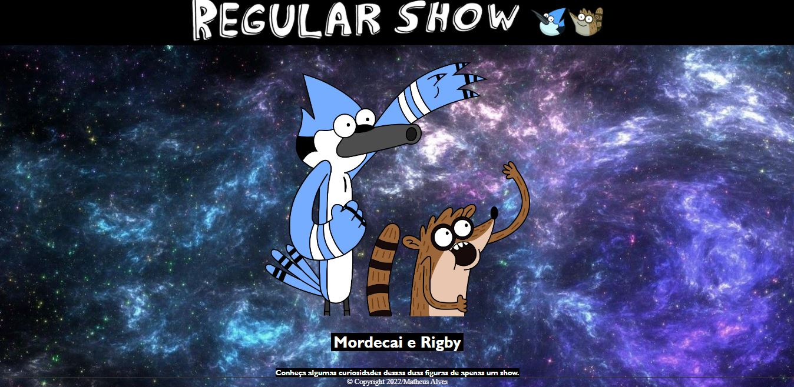

# Landing Page - Regular Show

[Clique Aqui](https://matheusalves099.github.io/atividade_LIMA/) para acessar o site.

---
## Sobre
Site do tipo landing page sobre o desenho Regular Show (Apenas um Show).
O objetivo deste projeto é colocar em prática os conhecimentos, sobre desenvolvimento de sites, adquiridos no curso do SENAI Jandira.

---
## Tecnologias utilizadas
- HTML5
- CSS3
- Responsividade
- Markdown

---
## Autor
- [Matheus Alves](https://www.linkedin.com/in/matheusalvesreisdasilva/)
